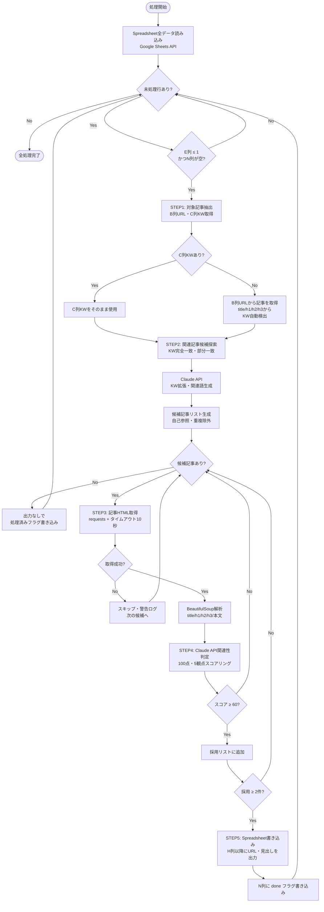

# NYSEO内部リンクAIエージェント 設計書

> 作成日: 2026-05-16

---

## 1. 技術スタック

| カテゴリ | 技術 | バージョン | 選定理由 |
|---|---|---|---|
| エージェント実行環境 | Cowork | 最新 | クライアント要件・ノーインフラ運用 |
| AI / LLM | Claude API（claude-sonnet-4-6） | claude-sonnet-4-6 | 日本語SEO関連性判定の高精度・コスト効率 |
| スクリプト言語 | Python | 3.10以上 | BeautifulSoup・Sheets API・requests全対応 |
| HTML解析 | BeautifulSoup4 + lxml | 4.12.x | 軽量・安定した記事解析・日本語対応 |
| HTTPクライアント | requests | 2.31.x | シンプルな外部URL取得・セッション管理 |
| データ基盤 | Google Spreadsheet | — | クライアントの既存環境を活用・操作が容易 |
| Sheets API | gspread + google-auth | 6.x | Python連携が最も容易・メンテナンス良好 |

---

## 2. システム構成

```
[クライアント]
    ↓ NYSEOデータ投入（手動 or 自動）
[Google Spreadsheet]
    ↓ Sheets API経由で読み取り
[Cowork + Pythonスクリプト]
    ├─ STEP1: 対象記事抽出
    ├─ STEP2: 関連記事候補探索 ──→ [Claude API]（KW拡張）
    ├─ STEP3: 記事HTML取得・解析（requests + BeautifulSoup）
    ├─ STEP4: 関連性判定 ──→ [Claude API]（スコアリング）
    └─ STEP5: 結果出力
         ↓ Sheets API経由で書き込み
[Google Spreadsheet H列以降]
    ↓ クライアントが確認・最終判断
[担当者がWordPressに手動で内部リンクを設置]
```

---

## 3. モジュール構成・ディレクトリ設計

```
nyseo-internal-link-agent/
├── main.py                    # エントリーポイント・全STEPを順次実行
├── config.py                  # 設定値（閾値・API設定・列番号定義）
├── requirements.txt           # 依存パッケージ一覧
├── .gitignore
│
├── steps/
│   ├── __init__.py
│   ├── step1_extract.py       # STEP1: 対象記事抽出
│   ├── step2_search.py        # STEP2: 関連記事候補探索
│   ├── step3_fetch.py         # STEP3: 記事HTML取得・解析
│   ├── step4_judge.py         # STEP4: AI関連性判定
│   └── step5_output.py        # STEP5: スプレッドシート出力
│
├── utils/
│   ├── __init__.py
│   ├── sheets_client.py       # Google Sheets API ラッパー
│   ├── claude_client.py       # Claude API ラッパー
│   └── logger.py              # ログ出力ユーティリティ
│
├── prompts/
│   ├── kw_expansion.txt       # STEP2: KW拡張プロンプトテンプレート
│   └── relevance_judge.txt    # STEP4: 関連性判定プロンプトテンプレート
│
└── docs/
    └── index.html             # GitHub Pages（クライアント向け仕様書）
```

---

## 4. データフロー

### 入力データ（Google Spreadsheet）

| 列 | 内容 | 型 | 役割 | 操作 |
|---|---|---|---|---|
| C列 | メインKW（GSCクリック最多） | string | STEP2の起点キーワード | 読み取りのみ |
| D列 | 記事URL | string（URL） | クロール対象URL・対象記事の識別子 | 読み取りのみ |
| E列 | 現在の内部リンク数 | integer | 対象記事の抽出条件（≤ 1） | 読み取りのみ |
| H列 | 貼るURL① | string（URL） | システム出力：候補1件目URL | 書き込み |
| I列 | 貼る箇所見出し① | string | システム出力：候補1件目の設置箇所見出し | 書き込み |
| J列 | 貼るURL② | string（URL） | システム出力：候補2件目URL | 書き込み |
| K列 | 貼る箇所見出し② | string | システム出力：候補2件目の設置箇所見出し | 書き込み |
| L列 | 貼るURL③（任意） | string（URL） | システム出力：候補3件目URL | 書き込み |
| M列 | 貼る箇所見出し③（任意） | string | システム出力：候補3件目の設置箇所見出し | 書き込み |
| N列 | 処理済みフラグ | string | 「done」で再処理スキップ | 書き込み |

### 中間データ（メモリ内・一時処理）

```python
# 対象記事リスト（STEP1出力）
target_articles = [
    {
        "row": 3,               # スプレッドシート行番号
        "kw": "SEO 内部リンク", # C列メインKW
        "url": "https://example.com/seo-internal-link/"
    },
    ...
]

# 候補記事解析結果（STEP3出力）
parsed_article = {
    "url": "https://example.com/article/",
    "title": "記事タイトル",
    "h1": "見出しH1",
    "h2_list": ["見出しA", "見出しB", "見出しC"],
    "h3_list": ["見出しD", "見出しE"],
    "body_text": "本文テキスト（先頭800文字程度）"
}

# AI判定結果（STEP4出力）
judgment_result = {
    "url": "https://example.com/article/",
    "score": 85,
    "reason": "検索意図が一致し、トピックの親和性が高い。",
    "recommended_heading": "内部リンクの重要性について"
}

# Spreadsheet書き込みデータ（STEP5 → 出力）
output_row = {
    "row": 3,
    "H": "https://example.com/related-article-1/",  # 候補記事URL①（この記事から対象記事へリンクを設置）
    "I": "内部リンクの重要性について",               # 候補記事①内でリンクを設置する見出し箇所
    "J": "https://example.com/related-article-2/",  # 候補記事URL②
    "K": "SEOの基礎知識",                           # 候補記事②内でリンクを設置する見出し箇所
    "L": "",                                          # 候補記事URL③（なければ空）
    "M": "",                                          # 候補記事③内の見出し箇所（なければ空）
    "N": "done"                                       # 処理済みフラグ
}
```

---

## 5. 外部連携

| 外部サービス | 用途 | 認証 | 注意事項 |
|---|---|---|---|
| Google Sheets API | Spreadsheet読み取り・書き込み | サービスアカウント（JSONキー） | スコープ: spreadsheets読み書き権限 |
| Claude API（Anthropic） | STEP2 KW拡張・STEP4 関連性判定 | APIキー（x-api-keyヘッダー） | 呼び出し間に0.5秒sleep・レート制限対応 |
| 対象サイト（HTTP） | STEP3 記事HTML取得 | なし（公開ページのみ） | タイムアウト10秒・リトライ2回・UA設定必須 |

---

## 6. エラー処理

| エラー種別 | 対応 | 処理継続 |
|---|---|---|
| HTTP取得失敗（404・タイムアウト等） | 該当記事をスキップ・警告ログ出力 | ✅ 継続 |
| Claude API エラー（5xx等） | 最大2回リトライ後、スキップ・エラーログ | ✅ 継続 |
| Sheets API 書き込みエラー | エラーログ出力・実行停止・手動確認を求める | ❌ 停止 |
| 候補記事が2件未満 | 閾値を60→40に下げて再判定。不足なら空欄出力 | ✅ 継続 |
| B列（記事URL）が空白 | 該当行をスキップ・警告ログ | ✅ 継続 |
| N列が「done」 | 処理済みとして完全スキップ | ✅ 継続 |

---

## 7. AI判定ロジック設計

### 7.1 関連性スコアリング設計

| 判定観点 | 重み | 配点 | 判定内容 |
|---|---|---|---|
| 検索意図一致度 | 30% | 0〜30点 | 対象記事を読むユーザーの検索意図と候補記事が一致するか |
| トピック一致度 | 25% | 0〜25点 | 扱っているトピック・テーマが同一または密接に関連しているか |
| 文脈自然性 | 20% | 0〜20点 | 対象記事の文中で候補記事へのリンクが自然に機能するか |
| SEO妥当性 | 15% | 0〜15点 | SEO観点でリンク元→リンク先のテーマ関連性が適切か |
| 内部リンク自然性 | 10% | 0〜10点 | 具体的なアンカーテキストとしてリンクが機能するか |
| **合計** | **100%** | **0〜100点** | |

### 7.2 判定基準・閾値設定

| スコア | 評価 | 採用判定 |
|---|---|---|
| 80〜100点 | 強く関連あり | ✅ 優先採用（最上位で出力） |
| 60〜79点 | 関連あり | ✅ 通常採用 |
| 40〜59点 | やや関連あり | ⚠️ 候補が2件未満の場合のみ採用（閾値下げ時） |
| 0〜39点 | 関連なし | ❌ 除外 |

### 7.3 除外条件

- 対象記事自身のURLと同一（自己リンク防止）
- スコア < 40点（最低閾値）
- HTTP取得に失敗した記事（404・タイムアウト等）
- カテゴリページ・タグページ・アーカイブページ（URLパターン: `/category/`・`/tag/`・`/page/`）
- すでにH列以降で提案済みのURL（同一対象記事内での重複防止）

### 7.4 プロンプト設計

**STEP2: KW拡張プロンプト**
```
あなたはSEO専門家です。
以下のメインキーワードに対して、内部リンク候補記事を探すために
関連語・共起語・類義語を10個以内で生成してください。

メインKW: {target_kw}

出力形式（JSON配列）:
["関連語1", "関連語2", "共起語1", ...]

注意: 日本語で、SEO実務で実際に使用されるキーワードのみ出力すること。
```

**STEP4: 関連性判定プロンプト**
```
あなたはSEO専門家です。以下の2記事の関連性を評価してください。

## 対象記事（被リンクを増やしたい記事・E列≤1）
- メインKW: {target_kw}
- URL: {target_url}

## 候補記事（対象記事へのリンクを設置する側の記事）
- タイトル: {candidate_title}
- URL: {candidate_url}
- 主要見出し: {candidate_headings}
- 本文冒頭: {candidate_body[:800]}

## 評価基準（100点満点）
- 検索意図一致度 (0-30点)
- トピック一致度 (0-25点)
- 文脈自然性 (0-20点)
- SEO妥当性 (0-15点)
- 内部リンク自然性 (0-10点)

## 出力形式（JSON）
{
  "score": 整数(0-100),
  "reason": "判定理由（1-2文で簡潔に）",
  "recommended_heading": "候補記事内で対象記事へのリンクを設置するのに最適な見出しテキスト"
}
```

---

## 8. 処理フロー設計

### 8.1 メイン処理フロー（Mermaid記法）



### 8.2 エラー時処理フロー

| 発生箇所 | エラー内容 | 処理フロー |
|---|---|---|
| STEP3 | HTTP 404・タイムアウト | 警告ログ出力 → 当該候補をスキップ → 次の候補へ進む |
| STEP4 | Claude API 5xx / レート制限 | 0.5秒待機 → リトライ（最大2回）→ 失敗時はスキップ |
| STEP5 | Sheets API 書き込み失敗 | エラーログ出力 → 実行停止 → ユーザーに手動確認を要求 |
| 全体 | 採用候補が2件未満 | 閾値を60→40に引き下げ → 再評価 → 不足なら空欄で出力 |

### 8.3 クライアント運用フロー

| 手順 | 担当 | 操作内容 |
|---|---|---|
| ① | クライアント | NYSEOデータをGoogle Spreadsheetに投入する |
| ② | システム運用者 | Cowork上でエージェントを起動する |
| ③ | システム | STEP1〜5を自動実行し、H列以降に結果を出力する |
| ④ | クライアント | スプレッドシートのH列以降を確認し、提案内容をレビューする |
| ⑤ | クライアント | レビューOKの内容をもとに、H列の候補記事（WordPressの当該記事）を開き、I列の見出し箇所に対象記事へのリンクを手動で設置する |
| ⑥ | クライアント | 再実行が必要な場合、N列の「done」フラグを削除してから再起動する |

---

## 9. 開発フェーズ

### Phase 1: 環境構築・基盤
- [ ] Pythonプロジェクト初期化（requirements.txt）
- [ ] Google Sheets API認証・接続テスト
- [ ] Claude API接続テスト
- [ ] スプレッドシートの読み取り動作確認

### Phase 2: コア機能実装
- [ ] STEP1: 対象記事抽出ロジック実装
- [ ] STEP2: KW探索・Claude APIによるKW拡張実装
- [ ] STEP3: 記事HTML取得・BeautifulSoupパース実装
- [ ] STEP4: Claude APIによる関連性スコアリング実装
- [ ] STEP5: スプレッドシートへの書き込み実装

### Phase 3: エラー処理・安定化
- [ ] HTTPタイムアウト・エラー処理実装
- [ ] APIリトライ・レート制限対応
- [ ] 処理済みフラグ機能実装
- [ ] ログ出力整備

### Phase 4: Cowork対応・テスト・引き渡し
- [ ] Cowork上での動作確認
- [ ] テストスプレッドシートでのエンドツーエンドテスト
- [ ] 実データでの精度確認・閾値調整
- [ ] クライアントへの説明・デモ・本番運用開始

---

## 10. セキュリティ考慮事項

- [ ] Claude APIキー・Googleサービスアカウントキーはプロジェクトフォルダ外のシークレットフォルダで管理
- [ ] `.gitignore` でAPIキー・認証ファイル（`*.json`・`.env`）をGit管理対象外に設定
- [ ] スプレッドシートの共有権限は最小限（必要なアカウントのみ編集権限）
- [ ] 外部サイトへのHTTPリクエストはGET取得のみ（書き込み・POST等は行わない）
- [ ] User-Agentに識別可能な文字列を設定（`NYSEOInternalLinkAgent/1.0`）

---

## 11. 将来拡張（本フェーズ対象外）

| 機能 | 概要 | 優先度 |
|---|---|---|
| WordPressへの自動反映 | 承認済みの内部リンクをWordPress REST APIで自動設置 | 高 |
| アンカーテキスト自動生成 | AIがリンクアンカーテキストまで自動提案する | 中 |
| Embedding活用 | テキストEmbeddingによる高精度な意味的関連性判定 | 中 |
| Search Console連携 | GSCデータと連携してリンク効果を計測・フィードバック | 低 |
| 内部リンク最適化スコアリング | サイト全体の内部リンク構造を最適化する高度ロジック | 低 |
